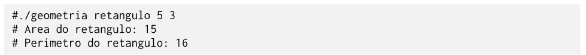

# Cálculos Geométricos

A Geometria é fundamental para resolver problemas em agricultura, astronomia, arquitetura e engenharia. Dentre as divisões da Geometria, encontram-se as chamadas Geometria Plana e Geometria Espacial. A Geometria Plana refere-se ao estudo das figuras geométricas definidas em um plano de duas dimensões, enquanto que a Geometria Espacial se encarrega do estudo das figuras geométricas (também chamadas de sólidos geométricos) definidas no espaço, ou seja, aquelas que possuem mais de duas dimensões e ocupam um lugar no espaço. As principais figuras geométricas planas são o triângulo, o quadrado, o retângulo e o círculo. Já as principais figuras geométricas espaciais são o cubo, a esfera, o cone, a pirâmide, o paralelepípedo e o cilindro.

Três conceitos são de suma importância para o entendimento das Geometrias Plana e Espacial, a saber, a área, o perímetro e o volume. A área de uma figura geométrica, seja ela plana ou espacial, expressa o tamanho de tal figura sobre uma superfície, de modo que quanto maior a superfície da figura, maior a sua área. O perímetro de uma figura geométrica é definido como a medida do contorno que delimita a figura, sendo resultante da soma das medidas de todos os seus lados. Por fim, o volume corresponde à medida do espaço ocupado por uma figura geométrica. Para encontrar os valores dessas medidas, é importante analisar o tipo da figura (se plana ou espacial) e a forma da figura, isto é, quantos e quais são os lados.

**Área, perímetro e volume de figuras geométricas planas e espaciais**

# O programa

O programa permite calcular as medidas de diversas figuras geométricas planas e espaciais de maneira automática. O código recebe, por meio da linha de comando, a indicação da forma geométrica e os dados necessários para os cálculos. Como resultado, o programa exibe as respectivas medidas (área, perímetro ou volume) da figura escolhida.

**Exemplos de entrada e saída**

Conforme mencionado anteriormente, o programa em execução deve receber por linha de comando a indicação da forma geométrica, seguida dos dados necessários para os cálculos. No exemplo a seguir, é passado na linha de comando a indicação da forma “retângulo”, seguido dos dados “base” e “altura”. Com isso, o programa irá instanciar a forma apropriada e imprimir o resultado dos cálculos.

